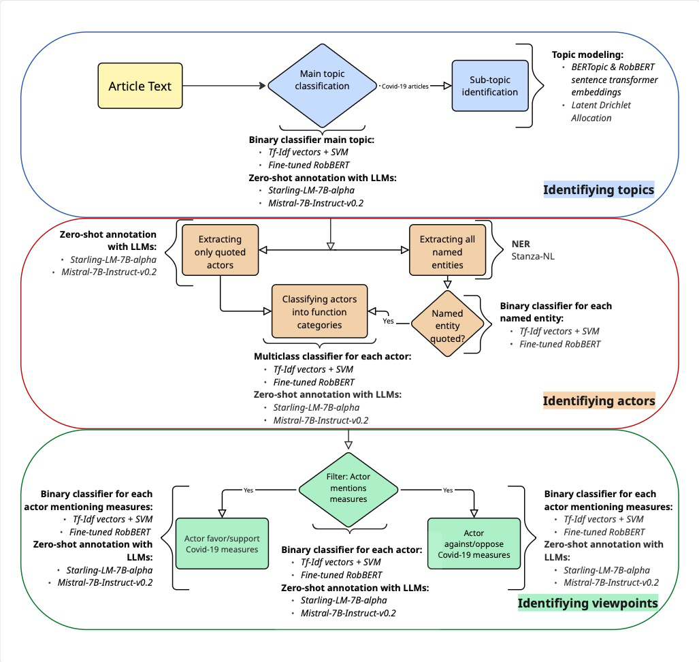

# Computational Analysis of News Content Diversity: A Comparison of Methods for Measuring Topics, Actors and Viewpoints

This repository accompanies the paper *"Computational Analysis of News Content Diversity: A Comparison of Methods for Measuring Topics, Actors and Viewpoints."*

The study compares four computational approaches, supervised text classification, topic modeling, named entity recognition, and open-source Large Language Models (LLMs), against gold-standard human annotations for identifying three subdimensions of news content diversity:

1. **Topic diversity**: the range of issues covered in the news.
2. **Actor diversity**: the representation of voices, their affiliations and status positions.
3. **Viewpoint diversity**: the spectrum of social, political and cultural perspectives presented.

Coverage of the Covid-19 pandemic by the Dutch public broadcaster (NOS.nl) serves as the test case. Articles mentioning `Covid*`, `Corona*` and `Sars-cov*` published between January 2020 and May 2022 were collected and analyzed.

## Repository structure

The `Scripts/` folder contains the Python notebooks, organized as a sequential pipeline that mirrors the analysis reported in the paper.

| Folder | Pipeline step |
| --- | --- |
| `1_Filter_Covid_Articles` | Main-topic classification (SVM, RobBERT, Mistral-7B, Starling-7B) to filter articles that substantively discuss the pandemic, plus full-corpus application |
| `2_Subtopic_Topic_Modeling` | Sub-topic identification with LDA and BERTopic at paragraph level |
| `3_Actor_Extraction_Function_Classification` | Actor identification via NER + quote classifiers (SVM/RobBERT) and via LLMs, then classification into four function categories |
| `4_Stance_Detection` | Viewpoint (stance) detection: whether an actor mentions Covid-19 measures, and whether the stance is supportive or opposing (SVM, RobBERT, LLMs) |
| `5_Annotation_Reliability` | Sampling procedure and inter-coder reliability analysis (Krippendorff's alpha) for the gold-standard annotations |
| `6_Evaluation` | Compilation of the performance-comparison tables reported in the paper |

The pipeline is summarized in the analysis workflow below:



The `Visualizations/` folder contains the figures used in the paper.

## Models

Two open-source, 7-billion-parameter LLMs are evaluated: **Mistral-7B-Instruct-v0.2** and **Starling-LM-7B-alpha**. Supervised classifiers use **RobBERT-2023** (a Dutch RoBERTa model) and a TF-IDF + **SVM** baseline. Named entity recognition uses the **Stanza** Dutch pipeline. See the paper's appendices for hyperparameters and prompts.

## Data

The article texts are **not** included in this repository. See [`data/README.md`](data/README.md) for what the notebooks expect.

## Environment

Dependencies are listed in `environment.yml` (conda). The analysis was run on the SURF Research Cloud (Linux, GPU).

```bash
conda env create -f environment.yml
conda activate mistralenv
```

## License

Released under the MIT License. See [`LICENSE`](LICENSE).
